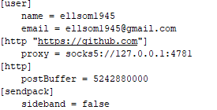

## 从配置文件开始



- http的proxy设置

  一把使用国内的网直接进行git push/pull操作网速一般都很感人，所以就有以下几种措施来解决这个问题：

  - 修改proxy，**前提是要有梯子**，原理就是当你git和你所配置的网站进行网络连接时，会从你的梯子的端口号走，也就相当于保证你git访问github的时候一定是通过梯子访问的，速度就取决于你的梯子质量了。
  
  - [gitee](https://gitee.com/)，这个也是一个很不错的解决方案，你可以完全使用gitee或者利用gitee来同步你的代码仓库，git操作gitee里面的仓库一般速度都是很快的。
  
  - 利用镜像网站，但由于不同网站收录水平不一样，就不列举了。

  - 修改host，github国内访问速度慢的原因是github的CDN被墙了，那什么是CDN呢，祭图：
    
    
  
    CDN就是建构在现有网络的基础上的一个新的层级，用于分发网络，使用户不需要从源站获取ip，利用接近用户的网络”边缘“的节点获取ip，提高访问速度，而CDN被墙就导致只能使用代理商提供的ip地址进行访问，所以访问速度会很慢。
  
    ​	    解决的方法就是绕过DNS解析，因为我们访问一个网址的时候是先通过检查浏览器缓存，再检查操作系统缓存，然后访问本地的hosts文件解析域名，如果都没解析成功才会接入代理商。
  
    ​		所以只要修改本地hosts文件就能解决这个问题：
  
    + 访问[DNS查询网站](https://www.ping.cn/dns/github.com)，查询github.com
    
    + 找一个TTL最小的ip，加入<C:\Windows\System32\drivers\etc\hosts>文件中,再加上github域名
    
    + 打开CMD刷新dns缓存
    
      ```sh
      ipconfig /flushdns
      ```
    
      
  
- postBuffer设置

  因为postBuffer默认只有1M，所以上传大文件时容易卡住甚至失败，解决方法：

  ```sh
  git config –global http.postBuffer 524288000
  ```

- sendpack设置

  有时候push会卡在结束页面，具体原因我也不清楚，据说把sideband修改为false就好了

  ```shell
  git config --global sendpack.sideband false
  ```

  