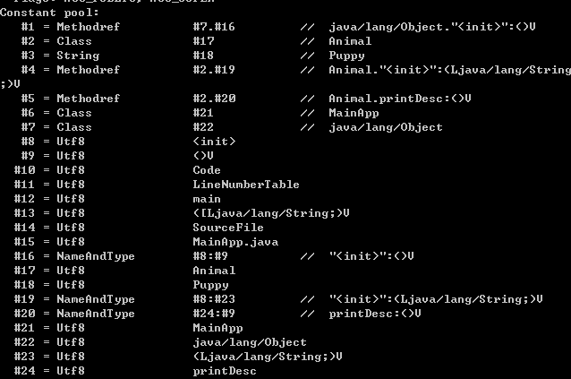

## 1.Java编译运行过程

- 首先，java代码由javac(JRE和JDK中)编译成.class文件(字节码ByteCode)


- 然后字节码由JVM解释运行


- 编译后的字节码文件格式主要分为两个部分：
  - 常量池，记录代码中出现过的常量、类名、成员变量等以及符号引用：类引用、方法引用、成员变量引用
  



  - 方法区，存放各种方法的字节码


- 当编译好MainApp.class后，执行java MainApp命令，开始进行类的加载
- 系统启动一个JVM进程找到MainApp.class二进制文件，将该文件中的类信息加载到运行时数据区的方法区
- 以如下程序为例：
```java
//MainApp.java  
public class MainApp {  
public static void main(String[] args) {  
       Animal animal = new Animal("Puppy");  
       animal.printName();  
   }  
}  
//Animal.java  
public class Animal {  
public String name;  
public Animal(String name) {  
this.name = name;  
   }  
public void printName() {  
       System.out.println("Animal ["+name+"]");  
   }  
}  
```


- JVM找到主函数入口后开始执行程序

- 发现常量池第一项就是对Animal对象的一个引用，于是JVM在方法区中加载Animal类型信息

- 在方法区加载完毕后就要为这个实例在堆中分配内存，然后调用构造函数生成实例，这个实例持有指向方法区Animal类的类型信息的引用(其中包含方法表，java动态绑定的底层实现)


- 当执行到animal.printName()的时候，JVM根据栈中的animal引用找到Animal对象，然后根据Animal对象的引用定位到Animal类的类型信息方法表，获取printName()的字节码地址，然后运行。

### TIPS

- 关于常量池：
  - 常量池的目的是为了避免频繁的创践和销毁对象，实现对象的共享
  
  - 字符串常量池在堆中，会在编译阶段把所有的字符串放放进去，并合并相同的字符串常量
  


## 2.JAVA语法

- char和String：java中char是2个字节，16个比特，0~2<sup>16</sup>-1，String则是若干个字节

- 泛型：

  - 首先泛型的本质就是参数化类型（Parameterized Type）的应用

  - java的泛型是伪泛型，编译时会被擦除，并使用其限定类型（无限定的变量用Object）替换,也就是说class文件中不存在泛型

    * 可以用<T extends/implements Element>的形式限制泛型向上的边界

  - 在指定泛型的情况下，该方法的几种类型必须是该泛型的实例的类型或者其子类
  
    ```java
    public class Test {  
        public static void main(String[] args) {  
    
            /**不指定泛型的时候*/  
            int i = Test.add(1, 2); //这两个参数都是Integer，所以T为Integer类型  
            Number f = Test.add(1, 1.2); //这两个参数一个是Integer，以风格是Float，所以取同一父类的最小级，为Number  
            Object o = Test.add(1, "asd"); //这两个参数一个是Integer，以风格是Float，所以取同一父类的最小级，为Object  
    
            /**指定泛型的时候*/  
            int a = Test.<Integer>add(1, 2); //指定了Integer，所以只能为Integer类型或者其子类  
            int b = Test.<Integer>add(1, 2.2); //编译错误，指定了Integer，不能为Float  
            Number c = Test.<Number>add(1, 2.2); //指定为Number，所以可以为Integer和Float  
        }  
    
        //这是一个简单的泛型方法  
        public static <T> T add(T x,T y){  
            return y;  
        }  
    }
    ```
  
    