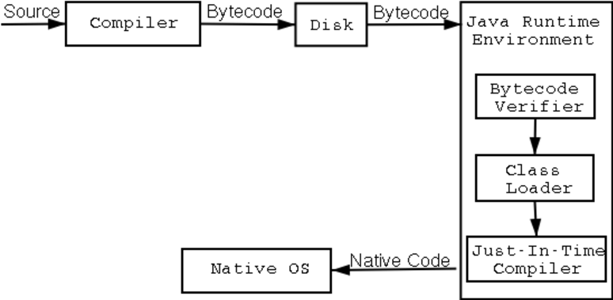

## 1.Java编译运行过程

- 首先，java代码由javac(JRE和JDK中)编译成`.class`文件(字节码ByteCode)


- 然后字节码由JVM解释运行



- 编译后的字节码文件格式主要分为两个部分：
  - 常量池，记录代码中出现过的常量、类名、成员变量等以及符号引用：类引用、方法引用、成员变量引用
  


  - 方法区，存放各种方法的字节码


- 当编译好`MainApp.class`后，执行`java MainApp`命令，开始进行类的加载
- 系统启动一个JVM进程找到`MainApp.class`二进制文件，将该文件中的类信息加载到运行时数据区的方法区
- 以如下程序为例：
```java
//MainApp.java  
public class MainApp {  
public static void main(String[] args) {  
       Animal animal = new Animal("Puppy");  
       animal.printName();  
   }  
}  
//Animal.java  
public class Animal {  
public String name;  
public Animal(String name) {  
this.name = name;  
   }  
public void printName() {  
       System.out.println("Animal ["+name+"]");  
   }  
}  
```


- JVM找到主函数入口后开始执行程序

- 发现常量池第一项就是对`Animal`对象的一个引用，于是JVM在方法区中加载`Animal`类型信息

- 在方法区加载完毕后就要为这个实例在堆中分配内存，然后调用构造函数生成实例，这个实例持有指向方法区`Animal`类的类型信息的引用(其中包含方法表，java动态绑定的底层实现)


- 当执行到`animal.printName()`的时候，JVM根据栈中的`animal`引用找到`Animal`对象，然后根据`Animal`对象的引用定位到`Animal`类的类型信息方法表，获取`printName()`的字节码地址，然后运行。

### TIPS

- 关于常量池：
  - 常量池的目的是为了避免频繁的创践和销毁对象，实现对象的共享
  
  - 字符串常量池在堆中，会在编译阶段把所有的字符串放放进去，并合并相同的字符串常量
  


## 2.JAVA语法

- ### char和String

  - java中`char`是2个字节，16个比特，0~2<sup>16</sup>-1，`String`则是若干个字节

- ### 泛型

  - 首先泛型的本质就是参数化类型（Parameterized Type）的应用

  - java的泛型是伪泛型，编译时会被擦除，并使用其限定类型（无限定的变量用`Object`）替换,也就是说class文件中不存在泛型

    * 可以用` <T extends/implements Element>`的形式限制泛型向上的边界

    * 要证明泛型擦除的存在，可以通过泛型类实例` getClass()`，或者利用反射:

      ```java
      public class Test {
      
          public static void main(String[] args) throws Exception {
      
              ArrayList<Integer> list = new ArrayList<Integer>();
      
              list.add(1);  //这样调用 add 方法只能存储整形，因为泛型类型的实例为 Integer
      
              list.getClass().getMethod("add", Object.class).invoke(list, "asd");
      
              for (int i = 0; i < list.size(); i++) {
                  System.out.println(list.get(i));
              }
          }
      
      }
      ```

      

  - 在指定泛型的情况下，该方法的几种类型必须是该泛型的实例的类型或者其子类

    ```java
    public class Test {  
        public static void main(String[] args) {  
    
            /**不指定泛型的时候*/  
            int i = Test.add(1, 2); //这两个参数都是Integer，所以T为Integer类型  
            Number f = Test.add(1, 1.2); //这两个参数一个是Integer，以风格是Float，所以取同一父类的最小级，为Number  
            Object o = Test.add(1, "asd"); //这两个参数一个是Integer，以风格是Float，所以取同一父类的最小级，为Object  
    
            /**指定泛型的时候*/  
            int a = Test.<Integer>add(1, 2); //指定了Integer，所以只能为Integer类型或者其子类  
            int b = Test.<Integer>add(1, 2.2); //编译错误，指定了Integer，不能为Float  
            Number c = Test.<Number>add(1, 2.2); //指定为Number，所以可以为Integer和Float  
        }  
    
        //这是一个简单的泛型方法  
        public static <T> T add(T x,T y){  
            return y;  
        }  
    }
    ```

  - 不能用类型参数替换基本类型。就比如，没有`ArrayList<double>`，只有`ArrayList<Double>`。因为当类型擦除后，`ArrayList`的原始类型变为`Object`，但是`Object`类型不能存储`double`值，只能引用`Double`的值

  - 泛型类中的静态方法和静态变量不可以使用泛型类所声明的泛型类型参数,因为**泛型类中的泛型参数的实例化是在定义对象的时候指定的**，而静态变量和静态方法不需要使用对象来调用

  - 为了解决类型擦除所引起的问题，需要先检查再编译

      ```java
      ArrayList<String> list1 = new ArrayList(); //第一种 情况
      ArrayList list2 = new ArrayList<String>(); //第二种 情况
      ```
      
      ​	第一种情况，可以实现与完全使用泛型参数一样的效果，第二种则没有效果。因为类型检查就是编译时完成的，`new ArrayList()`只是在内存中开辟了一个存储空间，可以存储任何类型对象，而**真正设计类型检查的是它的引用**，因为我们是使用它引用`list1`来调用它的方法，比如说调用`add`方法，所以`list1`引用能完成泛型类型的检查。而引用`list2`没有使用泛型，所以不行
      
  - 常用的通配符为： T，E，K，V，？
    * ？ 表示不确定的 java 类型
    * `T (type)` 表示具体的一个 java 类型
    * `K V (key value)` 分别代表 java 键值中的` Key Value`
    * `E (element) `代表 `Element`
    * T和？的区别：
      - 通过 T 来确保泛型参数的一致性，因为？是任意，不能指定
      - 类型参数可以多重限定而通配符不行
      - 通配符可以使用超类限定而类型参数不行，比如`T extends A `
      - 在反射时Class<T>需要声明或者指定类型，Class<?>不用

- ### ==和 equals 的区别

  - `==` : 它的作用是判断两个对象的地址是不是相等，就算是基本数据类型也是比较的地址，只不过基本数据类型变量都在常量池中，所以地址也是相等的

  - `equals()` : 它的作用也是判断两个对象是否相等，它不能用于比较基本数据类型的变量。类没有覆盖 `equals()`方法，则通过`equals()`比较该类的两个对象时，等价于通过“==”比较这两个对象，使用的默认是 `Object`类`equals()`方法；类覆盖了`equals()`方法，就用其自身的 `equals()`

    - 关于`String`的`equals()`方法：

      ```java
      public boolean equals(Object anObject) {
          if (this == anObject) {
              return true;
          }
          if (anObject instanceof String) {
              String anotherString = (String)anObject;
              int n = value.length;
              if (n == anotherString.value.length) {
                  char v1[] = value;
                  char v2[] = anotherString.value;
                  int i = 0;
                  while (n-- != 0) {
                      if (v1[i] != v2[i])
                          return false;
                      i++;
                  }
                  return true;
              }
          }
          return false;
      }
      ```

      ​	会先判断内存地址是否相等，即在字符串常量池中查找是否存在相同的对象，若没有再挨个字符比较（当创建 `String` 类型的对象时，虚拟机会在常量池中查找有没有已经存在的值和要创建的值相同的对象，如果有就把它赋给当前引用。如果没有就在常量池中重新创建一个 `String` 对象，所以`"a"+"b"=="ab"`,本质是一个变量）
